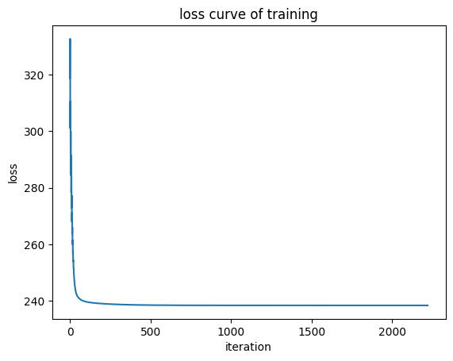
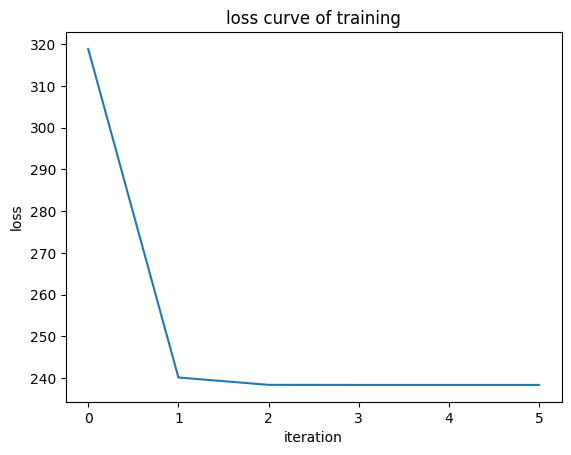

# Report

## 实验过程

### 对缺失数据根据其余样本分布填充

```python
for i in range(df.shape[1]):
    empty = df.iloc[:, i].isnull()
    df.iloc[empty.values, i] = np.random.choice(
        df.iloc[~empty.values, i].values, len(df.iloc[empty.values, i]))
```

### 将表格中的条目转换为数值

```python
df.Gender = df.Gender.map({'Male': 1, 'Female': 0})
df.Married = df.Married.map({'Yes': 1, 'No': 0})
df.Education = df.Education.map({'Graduate': 1, 'Not Graduate': 0})
df.Self_Employed = df.Self_Employed.map({'Yes': 1, 'No': 0})
df.Property_Area = df.Property_Area.map(
    {'Urban': 1.0, 'Semiurban': 0.5, 'Rural': 0.0})
df.Loan_Status = df.Loan_Status.map({'Y': 1, 'N': 0})
df.Dependents = df.Dependents.map({'0': 0.0, '1': 1.0, '2': 2.0, '3+': 3.0})
df.ApplicantIncome = df.ApplicantIncome.astype("float64")
```

### 将表格数值归一化到[0,1]区间范围内

```python
df = df.apply(lambda x: (x-np.min(x))/(np.max(x)-np.min(x)))
```

### 数据拆分

- 随机抽样

  ```python
  array = np.array(df)
  n = array.shape[0]
  train_index = set(np.random.choice(n, int(n/4*3), replace=False))
  test_index = set(range(n)) - train_index
  (train, test) = (array[np.array(list(train_index)), :],
                   array[np.array(list(test_index)), :])
  (X_train, y_train) = (train[:, :-1], train[:, -1:])
  (X_test, y_test) = (test[:, :-1], test[:, -1:])
  X_train = np.append(X_train, np.ones((X_train.shape[0], 1)), axis=1)
  X_test = np.append(X_test, np.ones((X_test.shape[0], 1)), axis=1)
  ```

- 十次四折交叉验证

  ```python
  positive = np.array(df.iloc[(df.iloc[:, 11] == 1.0).values, :])
  negative = np.array(df.iloc[(~(df.iloc[:, 11] == 1.0)).values, :])
  np.random.shuffle(positive)
  np.random.shuffle(negative)
  pn = positive.shape[0]
  nn = negative.shape[0]
  for i in range(10):
      for i in range(4):
          test_index_p = set(range(i*int(pn/4), (i+1)*int(pn/4)))
          train_index_p = set(range(pn)) - test_index_p
          (train_p, test_p) = (positive[np.array(list(train_index_p)), :],
                               positive[np.array(list(test_index_p)), :])
          test_index_n = set(range(i*int(nn/4), (i+1)*int(nn/4)))
          train_index_n = set(range(nn)) - test_index_n
          (train_n, test_n) = (negative[np.array(list(train_index_n)), :],
                               negative[np.array(list(test_index_n)), :])
          (train, test) = (np.r_[train_p, train_n], np.r_[test_p, test_n])
          (X_train, y_train) = (train[:, :-1], train[:, -1:])
          (X_test, y_test) = (test[:, :-1], test[:, -1:])
          X_train = np.append(X_train, np.ones((X_train.shape[0], 1)), axis=1)
          X_test = np.append(X_test, np.ones((X_test.shape[0], 1)), axis=1)
  ```

### 训练模型

#### sigmoid

```python
    def sigmoid(self, x):
        """The logistic sigmoid function"""
        return 1.0 / (1.0 + np.exp(-x))
```

#### grad

```python
    def grad(self, X, y):
        return X.T @ (self.sigmoid(X @ self.beta) - y)
```

#### hessian(海森矩阵)

```python
    def hessian(self, X):
        p1 = self.sigmoid(X @ self.beta).flatten()
        return X.T @ np.diag(p1) @ np.diag(1-p1) @ X
```

#### loss(包含l1/l2正则化)

```python
    def loss(self, X, y):
        regularization = 0
        if self.penalty == 'l1':
            regularization = self.gamma * np.sum(self.beta[:-1])
        elif self.penalty == 'l2':
            regularization = self.gamma * (self.beta[:-1].T @ self.beta[:-1])
        return (np.sum(np.log(1 + np.exp(X @ self.beta))) - (X @ self.beta).T @ y + regularization)[0][0]
```

#### iteration(利用梯度下降法或牛顿法更新权值)

```python
    def iteration(self, X, y, lr=None, pattern='newton'):
        if pattern == 'newton':
            return (1 if lr == None else lr) * (np.linalg.pinv(self.hessian(X)) @ self.grad(X, y))
        elif pattern == 'gd':
            return (0.005 if lr == None else lr) * self.grad(X, y)
```

#### fit(训练并绘制损失函数曲线)

```python
    def fit(self, X, y, lr=None, tol=1e-7, max_iter=1e7, pattern='gd'):
        """
        Fit the regression coefficients via gradient descent or other methods 
        """
        loss_table = []
        self.beta = np.zeros((X.shape[1], 1))
        before = self.loss(X, y)
        self.beta -= self.iteration(X, y, lr, pattern)
        after = self.loss(X, y)
        loss_table.append(before)
        loss_table.append(after)
        iter = 1
        while iter < max_iter and np.absolute(before-after) > tol:
            before = after
            self.beta -= self.iteration(X, y, lr, pattern)
            after = self.loss(X, y)
            iter += 1
            loss_table.append(after)
        times = np.arange(0, iter + 1)
        loss_table = np.array(loss_table).flatten()
        if self.plot:
            from matplotlib import pyplot as plt
            plt.title('loss curve of training')
            plt.xlabel('iteration')
            plt.ylabel('loss')
            plt.plot(times, loss_table)
            plt.show()
```

## Loss curve of one training process

### 梯度下降法



### 牛顿法



## The comparation table of different parameters

**采用十次四折交叉验证**

|                                         | 测试集上准确率 |    训练时长     |
| --------------------------------------- | :------------: | :-------------: |
| 梯度下降法(步长0.01)                    |       -        | 超过1分钟未结束 |
| 梯度下降法(步长0.005)                   |     0.815      |      10.4s      |
| 梯度下降法(步长0.001)                   |     0.815      |      44.2s      |
| 梯度下降法(步长0.005,l1正则化(参数2))   |     0.812      |      5.6s       |
| 梯度下降法(步长0.005,l1正则化(参数1))   |     0.815      |      6.4s       |
| 梯度下降法(步长0.005,l1正则化(参数0.5)) |     0.815      |      9.4s       |
| 梯度下降法(步长0.005,l2正则化(参数2))   |     0.814      |      5.1s       |
| 梯度下降法(步长0.005,l2正则化(参数1))   |     0.814      |      7.3s       |
| 梯度下降法(步长0.005,l2正则化(参数0.5)) |     0.815      |      8.6s       |
| 梯度下降法(步长0.005,tol=1e-5)          |     0.815      |      5.5s       |
| 梯度下降法(步长0.005,tol=1e-3)          |     0.814      |      1.7s       |
| 牛顿法                                  |     0.815      |      0.5s       |
| 牛顿法(l1正则化(参数2))                 |     0.814      |      0.3s       |
| 牛顿法(l1正则化(参数1))                 |     0.815      |      0.3s       |
| 牛顿法(l1正则化(参数0.5))               |     0.815      |      0.5s       |
| 牛顿法(l2正则化(参数2))                 |     0.814      |      0.5s       |
| 牛顿法(l2正则化(参数1))                 |     0.814      |      0.5s       |
| 牛顿法(l2正则化(参数0.5))               |     0.815      |      0.5s       |
| 牛顿法(tol=1e-5)                        |     0.815      |      0.5s       |
| 牛顿法(tol=1e-3)                        |     0.815      |      0.5s       |
| 牛顿法(保留第6789列特征)                |     0.814      |      0.5s       |
| 牛顿法(保留第69列特征)                  |     0.814      |      0.5s       |
| 牛顿法(保留第9列特征)                   |     0.812      |      0.5s       |

根据以上参数对比可知

- 梯度下降法 `步长为0.005` 时收敛较快
- 梯度下降法 `l1/l2正则化` 正则化参数较大时会降低准确率，可能是因为数据集过小
- 梯度下降法 `l1/l2正则化` 正则化参数较大时会提高训练速率
- 梯度下降法 `停止阈值`增大会略微降低准确率，但提高训练速率
- 牛顿法 `l1/l2正则化` 正则化参数较大时会降低准确率，可能是因为数据集过小
- 牛顿法 `l1/l2正则化` 正则化参数较大时会提高训练速率
- 牛顿法 `停止阈值`增大对准确率和训练速率均无明显影响
- 根据训练得到的权值删去部分权值较小的属性会使准确率略微下降

## The best accuracy of test data

单次训练的最好准确率为：0.9155844155844156

十次四折交叉验证的最好平均准确率为 0.8153594771241834

