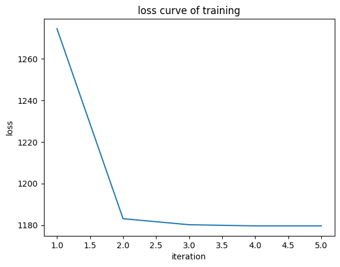
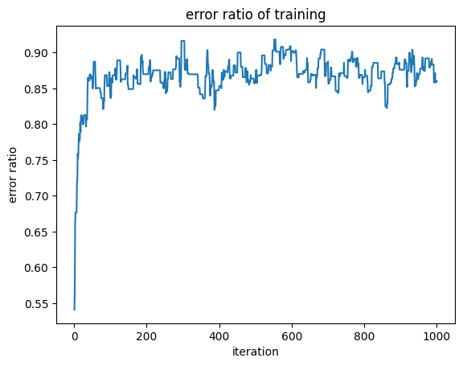

# Report

## 实验原理

### 支持向量机基本型

支持向量机使用超平面方程 $w^{\mathrm{T}}x+b=0$ 来划分两类样本，为了最大化超平面和样本间的间隔，优化目标为

$$
\operatorname*{max}_{w,b}{\frac{2}{\|w\|}}\\
s.t.y_{i}(w^{\mathsf{T}}x_{i}+b)\geq1\qquad i=1,\cdots,m
$$

这等价于

$$
\operatorname*{min}_{w,b}{{\frac{1}{2}}}\|w\|^{2}\\
s.\mathrm{t.}y_{i}\bigl(w^{\mathsf{T}}x_{i}+b\bigr)\geq1\qquad i=1,\cdots,m
$$

### 软间隔支持向量机

为了解决数据集线性不可分的问题，引入软间隔的概念, 允许支持向量机在一些样本上不满足约束

#### 目标函数视角

优化目标为

$$
\operatorname*{min}_{w,b}\frac{1}{2}||w||^{2}+C\sum_{i=1}^{m}\ell_{0/1}(y_{i}(w^{T}x_{i}+b)-1)
$$

为便于求导，将0/1损失函数 $\ell_{0/1}$ 替换为hinge损失函数 $\ell_{h i n g e}(z)=\operatorname*{max}(0,1-z)$

新的优化目标为

$$
\operatorname*{min}_{w,b}~\frac{1}{2}\vert\vert w\vert\vert^{2}+C\sum_{i=1}^{m}\operatorname*{max}\left(0,1-y_{i}\left(w^{\mathrm{T}}x_{i}+b\right)\right)
$$

对损失函数求导得到

$$
\bigtriangledown f(w,b)=w-C\sum_{i=1}^{m}I\left(1-y_{i}\left(w^{\mathrm{T}}x_{i}+b\right)>0\right)y_{i}x_{i}
$$

损失函数是凸函数，使用梯度下降法可以得到最优解

#### 引入松弛变量

引入松弛变量 $\xi_{i}\ge0$ ，可以将上面的优化目标重写为

$$
\operatorname*{min}_{w,b,\xi_i}\ {\frac{1}{2}}\|w\|^{2}+C\sum_{i=1}^{m}\xi_{i}\\
\mathrm{s.t.}\,\,\,\,y_{i}(w^{\mathrm{T}}x_{i}+b)\ge1-\xi_{i}\\
\xi_{i}\ge0 \quad i=1,2,\cdots,m
$$

使用拉格朗日乘子法得到拉格朗日函数


$$
{\cal L}(w,b,\xi,\alpha,\beta)={\frac{1}{2}}\|w\|^{2}+C\sum_{i=1}^{m}\xi_{i}-\sum_{i=1}^{m}\alpha_{i}(y_{i}(w^{T}\phi(x_{i})+b)-1+\xi_{i})-\sum_{i}^{m}\mu_{i}\xi(x_{i})\\\
\alpha_{i},\mu_{i}\geq0
$$

令 ${\cal L}(w,b,\xi,\alpha,\beta)$ 对 $w,\;b,\;\xi_{i}$ 的偏导为0，可以得到对偶问题

$$
{\operatorname*{max}_{\alpha}}{{}\sum_{i=1}^{m}\alpha_{i}-{\frac{1}{2}}\:\sum_{i=1}^{m}\sum_{j=1}^{m}\alpha_{i}\alpha_{j}y_{i}y_{j}x_{i}^{\mathrm{T}}x_{j}}\\\\
{\mathrm{s.t.}}\;\;\sum_{i=1}^{m}\alpha_{i}y_{i}=0\;,0\leqslant\alpha_{i}\leqslant C\ ,\quad i=1,2,\dots,m
$$

KKT条件为

$$
\left\{\begin{array}{l l}{{\alpha_{i}\ge 0~,~}}{{\mu_{i}\ge 0~,}}\\ {{y_{i}f(x_{i})-1+\xi_{i}\ge 0~,}}\\ {{\alpha_{i}(y_{i}f(x_{i})-1+\xi_{i})=0~,}}\\ {{\xi_{i}\ge 0~,~\mu_{i}\xi_{i}=0~}}\end{array}\right.
$$

对偶问题受 

$$
\sum_{i=1}^{m}\alpha_{i}y_{i}=0\;,0\leqslant\alpha_{i}\leqslant C\ ,\quad i=1,2,\dots,m
$$

约束

因此通过序列通过序列最小优化（ SMO ）求解最优的 $\alpha$ ，每次调整两个变量，不破坏约束条件

##### 序列最小优化（ SMO ）

###### 基本思路

不断执行如下两个步骤直至收敛 

- 第一步：选取一对需更新的变量 $\alpha_i$ 和 $\alpha_j$
- 第二步：固定 $\alpha_i$ 和 $\alpha_j$ 以外的参数, 求解对偶问题更新 $\alpha_i$ 和 $\alpha_j$

记 $K_{ii}=x_i^Tx_j$ ， $f(x_{i})=\sum_{j=1}^{n}y_{j}\alpha_{j}K_{i j}+b$ ， $v_{i}=f(x_{i})-\sum_{j=1}^{2}y_{j}\alpha_{j}K_{i j}-b$

在仅考虑 $\alpha_i$ 和 $\alpha_j$ 时，优化目标可以写作

$$
g(\alpha_{i},\alpha_{j})=\alpha_{i}+\alpha_{j}-{\frac{1}{2}}\Biggl(\alpha_{i}^{2}K_{i i}+\alpha_{j}^{2}K_{j j}+2\alpha_{i}\alpha_{j}y_{i}y_{j}K_{i j}+a_{i}y_{i}\sum_{k\ne i,j}a_{k}y_{k}K_{i k}+\alpha_{j}y_{j}\sum_{k\neq i,j}a_{k}y_{k}K_{j k}{\Biggr)}
$$

约束变为

$$
\alpha_{i}y_{i}+\alpha_{j}y_{j}=-\sum_{k\neq i,j}^{m}\alpha_{i}y_{i}=constant
$$

因此 $\alpha_i$ 可以用 $\alpha_j$ 表示， $\alpha_{i}=y_iconstant-y_iy_j\alpha_{j}=\gamma-s\alpha_{j}$ ，取 $\alpha_j$ 为变量，则优化目标写作

$$
\begin{array}{r c l}{{W(\alpha_{j})}}&{{=}}&{{\gamma-s\alpha_{j}+\alpha_{j}-\frac{1}{2}K_{ii}(\gamma-s\alpha_{j})^{2}-\frac{1}{2}K_{jj}\alpha_{j}^{2}}}\\ {{}}&{{}}&{{-s K_{ij}(\gamma-s\alpha_{j})\alpha_{j}-y_{i}(\gamma-s\alpha_{j})v_{i}-y_{j}\alpha_{j}v_{j}+\mathrm{constant}}}\end{array}
$$

对 $\alpha_j$ 求偏导有

$$
\begin{array}{r c l}{{\displaystyle\frac{\partial W(\alpha_{j})}{\partial\alpha_{j}}}}{{=}}{{-s+1+s K_{ii}\gamma-K_{ii}\alpha_{j}-K_{jj}\alpha_{j}+2K_{ij}\alpha_{j}-s K_{ij}\gamma+y_{j}v_{i}-y_{j}v_{j}\nonumber=0}}\end{array}
$$

得到

$$
\alpha_{j}^{n e w}=\frac{y_{j}(y_{j}-y_{i}+y_{i}\gamma(K_{ii}-K_{ij})+v_{i}-v_{j})}{K_{ii}+K_{jj}-2K_{ij}}
$$

令 $E_{i}=f(x_{i})-y_{i}$， $K=K_{ii}+K_{jj}-2K_{ij}$ ，上述结果化简为

$$
\alpha_{j}^{n e w}=\alpha_{j}^{o l d}+\frac{y_{j}(E_{i}-E_{j})}{K}
$$

再考虑限制条件 $0\leqslant\alpha_{j}\leqslant C$ ，得到其下界和上界分别为

$$
L=\left\{\begin{array}{ll}
\max \left\{0, \alpha_{j}^{\text {old }}-\alpha_{i}^{\text {old }}\right\} & y_{i} y_{j}=-1 \\
\max \left\{0, \alpha_{i}^{\text {old }}+\alpha_{j}^{\text {old }}-C\right\} & y_{i} y_{j}=1
\end{array},H=\left\{\begin{array}{ll}
\min \left\{C, C+\alpha_{j}^{\text {old }}-\alpha_{i}^{\text {old }}\right\} & y_{i} y_{j}=-1 \\
\min \left\{C, \alpha_{j}^{\text {old }}+\alpha_{i}^{\text {old }}\right\} & y_{i} y_{j}=1
\end{array}\right.\right.
$$

用这个区间截断得到最终的 $\alpha_{j}^{n e w}$

另一个变量 $\alpha_i$ 可以由 $\alpha_{j}^{n e w}$ 得到

$$
\alpha_{i}^{o l d}y_{i}+\alpha_{j}^{o l d}y_{j}=constant\to\alpha_{i}^{o l d}+\alpha_{j}^{o l d}y_{j}y_{i}=\gamma\\
\alpha_{i}^{n e w}+\alpha_{j}^{n e w}y_{j}y_{i}=\gamma\\
\alpha_{i}^{n e w}-\alpha_{i}^{o l d}+(\alpha_{j}^{n e w}-\alpha_{j}^{o l d})y_{j}y_{i}=0\rightarrow\alpha_{i}^{n e w}-\alpha_{i}^{o l d}=y_{i}y_{j}(\alpha_{j}^{o l d}-\alpha_{j}^{n e w})\\
\alpha_{i}^{n e w}=\alpha_{i}^{o l d}+y_{i}y_{j}(\alpha_{j}^{o l d}-\alpha_{j}^{n e w})
$$

之后再更新b

$$
b_{i}^{n e w}=-E(x_{i})-y_{i}k_{ii}(\alpha_{i}^{n e w}-\alpha_{i}^{o d d})-y_{j}k_{ji}(\alpha_{j}^{n e w}-\alpha_{j}^{o d d})+b^{o d d}\\
b_{j}^{n e w}=-E(x_{i})-y_{i}k_{ii}(\alpha_{i}^{n e w}-\alpha_{i}^{o l d})-y_{j}k_{ji}(\alpha_{j}^{n e w}-\alpha_{j}^{o l d})+b^{o d d}\\
b^{n e w}=\frac{b_{i}^{n e w}+b_{j}^{n e w}}{2}
$$

###### 启发式选择

若 $\alpha_i$ 和 $\alpha_j$ 有一个违反了KKT条件，目标函数就会在迭代后增大，当KKT条件违背的程度越大，则变量更新后可能导致的目标函数值增幅越大，因此采用启发式的方法选择两个变量

- 第一个变量：选取违背KKT条件程度最大的变量第二个变量：与第一个变量的间隔最大的变量
- 第二个变量：与第一个变量的间隔最大的变量 

根据式9中的KKT条件，违反KKT条件的情形可以总结如下

- $\alpha_i\lt C$ 且 $y_if(x_i)\lt1$
- $\alpha_i\gt 0$ 且 $y_if(x_i)\gt1$

## 实验步骤

- 数据拆分（随机抽样/四次四折交叉验证）

### 训练模型一（软间隔支持向量机 梯度下降法）

- 初始化参数w
- 计算梯度
- 根据梯度更新参数w
- 更新损失函数
- 判断是否结束训练

### 训练模型二（软间隔支持向量机 SMO）

1.初始化参数 $\alpha$

2.遍历所有的 $\alpha$，对不满足KKT条件的 $\alpha_j$，启发式的寻找另一个 $\alpha_i$ 试图更新

3.遍历所有边界上的 $\alpha$ ，对不满足KKT条件的 $\alpha_j$ ，启发式的寻找另一个 $\alpha_i$ 试图更新

4.如果上一步没有成功更新的 $\alpha$ ，结束训练，否则返回第二步

对 $\alpha_i$ 的启发式寻找：

1.找与 $\alpha_j$ 的误差相差最大的 $\alpha_i$

2.在边界上随机选择

3.在剩余的 $\alpha$ 中随机选择

## 实现代码

### 数据拆分

- 随机抽样

  ```python
  train_index = set(np.random.choice(num, int(num / 4 * 3), replace=False))
  test_index = set(range(num)) - train_index
  (train, test) = (np.array(list(train_index)), np.array(list(test_index)))
  (X_train, y_train) = (X_data[train], y_data[train])
  (X_test, y_test) = (X_data[test], y_data[test])
  ```

- 四次四折交叉验证

  ```python
  positive = data[(y_data == 1.0).flatten(), :]
  negative = data[(~(y_data == 1.0)).flatten(), :]
  pn = positive.shape[0]
  nn = negative.shape[0]
  modelSVM_acc = []
  model1_acc = []
  model2_acc = []
  modelSVM = LinearSVC(fit_intercept=0, dual=False)
  model1 = SVM1(dim, plot=False)
  model2 = SVM2(dim, plot=False)
  for i in range(4):
      np.random.shuffle(positive)
      np.random.shuffle(negative)
      for i in range(4):
          test_index_p = set(range(i * int(pn / 4), (i + 1) * int(pn / 4)))
          train_index_p = set(range(pn)) - test_index_p
          (train_p, test_p) = (positive[np.array(
              list(train_index_p)), :], positive[np.array(list(test_index_p)), :])
          test_index_n = set(range(i * int(nn / 4), (i + 1) * int(nn / 4)))
          train_index_n = set(range(nn)) - test_index_n
          (train_n, test_n) = (negative[np.array(
              list(train_index_n)), :], negative[np.array(list(test_index_n)), :])
          (train, test) = (np.r_[train_p, train_n], np.r_[test_p, test_n])
          (X_train, y_train) = (train[:, :-1], train[:, -1:])
          (X_test, y_test) = (test[:, :-1], test[:, -1:])
          modelSVM.fit(X_train, y_train.flatten())
          model1.fit(X_train, y_train)
          model2.fit(X_train, y_train)
          modelSVM_acc.append(modelSVM.score(X_test, y_test.flatten()))
          model1_acc.append(model1.score(X_test, y_test))
          model2_acc.append(model2.score(X_test, y_test))
  print('sklearn accuracy:{:.4f}'.format(sum(modelSVM_acc) / len(modelSVM_acc)))
  print('model1 accuracy:{:.4f}'.format(sum(model1_acc) / len(model1_acc)))
  print('model2 accuracy:{:.4f}'.format(sum(model2_acc)/len(model2_acc)))
  ```

### 训练模型一（软间隔支持向量机 梯度下降法）

#### grad（式5）

```python
    def grad(self, X, y):
        temp = 1 - (X @ self.w) * y
        # 在max内部的值大于0时，才计算对应项的导数
        flag = np.array(np.frompyfunc(lambda x: 1.0 if x >
                        0 else 0.0, 1, 1)(temp), np.float64)
        return self.w - (self.C * (y.T @ (flag * X))).T
```

#### loss（式4）

```python
    def loss(self, X, y):
        temp = 1 - (X @ self.w) * y
        flag = np.array(np.frompyfunc(lambda x: 1.0 if x >
                        0 else 0.0, 1, 1)(temp), np.float64)
        return (0.5 * (self.w.T @ self.w) + self.C * np.sum((flag * temp).flatten()))[0][0]
```

#### iteration(利用梯度下降法更新权值)

```python
    def iteration(self, X, y):
        # 步长较大时会反复震荡，因此将步长设为0.00001
        return 0.00001 * self.grad(X, y)
```

#### fit(训练并绘制损失函数曲线)

```python
    def fit(self, X, y, tol=1e-2, max_iter=1e2):
        """
        Fit the coefficients via your methods
        """
        self.w = np.zeros((self.dim, 1))
        loss_table = []
        before = after = 0
        iter = 0
        # 通过前后两次迭代的损失函数值的差值来判断是否收敛
        while iter == 0 or (iter < max_iter and np.absolute(before - after) > tol):
            before = after
            self.w -= self.iteration(X, y)
            after = self.loss(X, y)
            iter += 1
            loss_table.append(after)
        if self.plot:
            from matplotlib import pyplot as plt
            plt.title('loss curve of training')
            plt.xlabel('iteration')
            plt.ylabel('loss')
            plt.plot(np.arange(1, iter + 1), np.array(loss_table).flatten())
            plt.show()
```

#### predict & score（在测试集上计算结果）

```python
    def predict(self, X):
        """
        Use the trained model to generate prediction probabilities on a new
        collection of data points.
        """
        # 计算预测值，并映射到±1
        return np.array(np.frompyfunc(lambda x: 1.0 if x > 0 else -1.0, 1, 1)(X @ self.w), np.float64)

    def score(self, X, y):
        result = self.predict(X)
        delta = np.array(np.frompyfunc(lambda x: 1.0 if x ==
                                       0 else 0.0, 1, 1)(result-y), np.float64)
        num = np.sum(delta)
        return num / delta.shape[0]
```

### 训练模型二（软间隔支持向量机 SMO）

#### update（更新当前结果与实际值的差异，式14中E）

```python
    def update(self, X, y):
        self.w = np.sum(y * self.alpha * X, axis=0).reshape(self.dim, 1)
        self.E = X @ self.w - y # 计算预测值与理论值的误差，用于计算alpha
        if self.fit_intercept:
            self.E += self.b
        self.r = self.E * y # 计算误差与标签的乘积，用于计算alpha，在此处全部计算，而不是在计算alpha时再计算，是为了减少计算量
```

#### select（启发式选择变量）

```python
    def select(self, X, y, j):
        self.delta = self.E - self.E[j][0] # 计算误差的差值
        self.delta = np.maximum(self.delta, - self.delta) # 计算差值的绝对值
        return np.argmax(self.delta, axis=0)[0] # 返回最大差值对应的下标
```

#### error

```python
    def error(self, X, y):
        # 用训练集上的错误率计算代替计算损失函数，计算损失函数所需计算量较大，而错误率可以用每次迭代的结果self.w来计算
        result = self.score(X, y)
        # 在迭代时发现会过拟合，因此在迭代时记录最大的score，并记录当时的self.w
        if result > self.score_max:
            self.score_max = result
            self.w_max = self.w
        return result
```

#### takestep(对两个变量更新)

```python
    def takestep(self, X, y, i, j, tol=1e-3):
        if i == j:
            return False
        # 计算alpha的上下界
        if y[i][0] != y[j][0]:
            L = max(0, self.alpha[j][0] - self.alpha[i][0])
            H = min(self.C, self.C + self.alpha[j][0] - self.alpha[i][0])
        else:
            L = max(0, self.alpha[i][0] + self.alpha[j][0] - self.C)
            H = min(self.C, self.alpha[i][0] + self.alpha[j][0])
        if L == H:
            return False
        newj = self.alpha[j][0] + y[j][0] * (self.E[i][0] - self.E[j][0]) / (
            X[i] @ X[i].T + X[j] @ X[j].T - 2 * (X[i] @ X[j].T))
        if newj < L:
            newj = L
        if newj > H:
            newj = H
        # 当alpha的变化量小于阈值时，不更新，加快迭代速度
        if abs(newj - self.alpha[j][0]) < tol:
            return False
        newi = self.alpha[i][0] + y[i][0] * \
            y[j][0] * (self.alpha[j][0] - newj)
        if self.fit_intercept:
            newbi = -self.E[i][0] - y[i][0] * (newi - self.alpha[i][0]) * (X[i] @ X[i].T) - y[j][0] * (
                newj - self.alpha[j][0]) * (X[i] @ X[j].T) + self.b
            newbj = -self.E[j][0] - y[i][0] * (newi - self.alpha[i][0]) * (X[i] @ X[j].T) - y[j][0] * (
                newj - self.alpha[j][0]) * (X[j] @ X[j].T) + self.b
            self.b = (newbi + newbj) / 2
        (self.alpha[i][0], self.alpha[j][0]) = (newi, newj)
        self.update(X, y)
        return True
```

#### examine（选定了一个变量后尝试选择第二个变量）

```python
    def examine(self, X, y, j, tol=1e-1):
        # 当alpha[j]满足KKT条件时，不更新，在这里引入阈值tol，允许alpha[j]与KKT条件不完全符合，以加快迭代速度
        if (self.r[j] < -tol and self.alpha[j] < self.C) or (self.r[j] > tol and self.alpha[j] > 0):
            if self.alpha[j] > 1:
                # 选择与alpha[j]误差最大的alpha[i]进行更新
                i = self.select(X, y, j)
                if self.takestep(X, y, i, j):
                    return 1
            temp = list(range(y.shape[0]))
            random.shuffle(temp)
            # 前面更新失败时选择的alpha[i]可能不是最优的，因此随机选择在边界上的alpha[i]进行更新
            for i in temp:
                if self.alpha[i] != 0 or self.alpha[i] != self.C:
                    if self.takestep(X, y, i, j):
                        return 1
            random.shuffle(temp)
            # 仍然失败时，随机选择alpha[i]进行更新
            for i in temp:
                if self.takestep(X, y, i, j):
                    return 1
        return 0
```

#### fit(训练并绘制错误率函数曲线)

```python
    def fit(self, X, y, max_iter=1e3):
        """
        Fit the coefficients via your methods
        """
        random.seed(0)
        self.alpha = np.zeros(y.shape)
        self.update(X, y)
        error_table = []
        iter = 0
        numChanged = 0
        examineAll = 1
        # 没有可更新的alpha时，迭代结束
        while iter < max_iter and (numChanged > 0 or examineAll == 1):
            numChanged = 0
            if examineAll == 1:
                # 遍历所有样本，对每个样本进行检查
                for j in range(y.shape[0]):
                    numChanged += self.examine(X, y, j)
                    iter += 1
                    error_table.append(self.error(X, y))
                    if iter == max_iter:
                        break
            else:
                # 遍历所有在边界上的样本，对每个样本进行检查
                for j in range(y.shape[0]):
                    if self.alpha[j] != 0 or self.alpha[j] != self.C:
                        numChanged += self.examine(X, y, j)
                        iter += 1
                        error_table.append(self.error(X, y))
                        if iter == max_iter:
                            break
            if examineAll == 1:
                examineAll = 0
            elif numChanged == 0:
                examineAll = 1
        self.w = self.w_max
        if self.plot:
            from matplotlib import pyplot as plt
            plt.title('error ratio of training')
            plt.xlabel('iteration')
            plt.ylabel('error ratio')
            plt.plot(np.arange(1, iter + 1), np.array(error_table).flatten())
            plt.show()
```

#### predict & score（在测试集上计算结果）

```python
    def predict(self, X):
        """
        Use the trained model to generate prediction probabilities on a new
        collection of data points.
        """
        # 计算预测值，并映射到±1
        return np.array(np.frompyfunc(lambda x: 1.0 if x > 0 else -1.0, 1, 1)(X @ self.w + (self.b if self.fit_intercept else 0)), np.float64)

    def score(self, X, y):
        result = self.predict(X)
        delta = np.array(np.frompyfunc(lambda x: 1.0 if x ==
                                       0 else 0.0, 1, 1)(result-y), np.float64)
        num = np.sum(delta)
        return num / delta.shape[0]
```

## 实验结果

### 20维 10000样本数据集(75%训练集，25%测试集)

#### 训练模型一（软间隔支持向量机 梯度下降法）

mislabel:0.0349

accuracy:0.9592

时长:0.2s



#### 训练模型二（软间隔支持向量机 SMO）

mislabel:0.0349

accuracy:0.9216

时长:4.9s



## 方法比较

#### [大数据集]20维 10000样本数据集(75%训练集，25%测试集)

（软间隔支持向量机 梯度下降法）和（软间隔支持向量机 SMO）的结果参照上面的结果

mislabel:0.0349

|            模型             | 时间 | 准确率 |
| :-------------------------: | :--: | :----: |
|       sklearn（参考）       | 0.1s | 0.9588 |
| 软间隔支持向量机 梯度下降法 | 0.2s | 0.9592 |
|    软间隔支持向量机 SMO     | 4.9s | 0.9216 |

#### [超大数据集] 20维 100000样本数据集(75%训练集，25%测试集)

mislabel:0.03621

|            模型             | 时间  | 准确率 |
| :-------------------------: | :---: | :----: |
|       sklearn（参考）       | 0.9s  | 0.9612 |
| 软间隔支持向量机 梯度下降法 | 2.4s  | 0.9504 |
|    软间隔支持向量机 SMO     | 38.7s | 0.9200 |

#### [四折交叉验证]20维 10000样本数据集(75%训练集，25%测试集)

mislabel:0.0349

|            模型             | 准确率 |
| :-------------------------: | :----: |
|       sklearn（参考）       | 0.9592 |
| 软间隔支持向量机 梯度下降法 | 0.9590 |
|    软间隔支持向量机 SMO     | 0.9216 |

## 结果分析

梯度下降法在时间与准确率上均优于SMO法，但两者均与sklearn有差距，在大数据集较为明显

- 梯度下降法的参数 $w$ 的维数与样本数目无关，在维度较小时梯度易于计算
- SMO算法的参数 $\alpha$ 的维数和样本数量相同，在样本数很大时，每次只能更新两个变量导致更新所有变量需要很多迭代次数，因此SMO算法不能迅速收敛，受电脑性能限制，只迭代了1000次，因此准确率不高
- KKT条件仅是最优解的必要条件，SMO法只能求得近似最优解而不能保证是全局最优解
