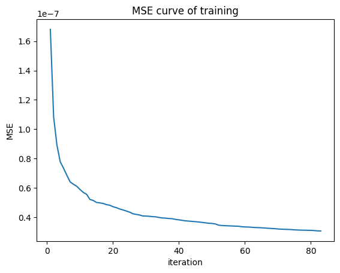
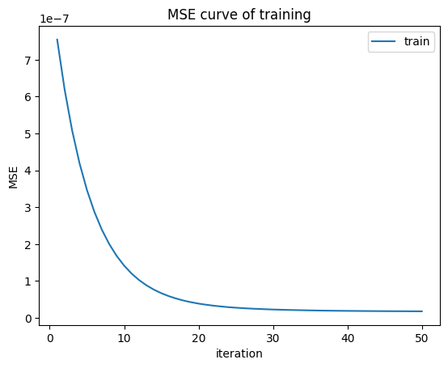
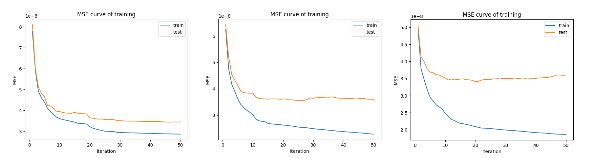
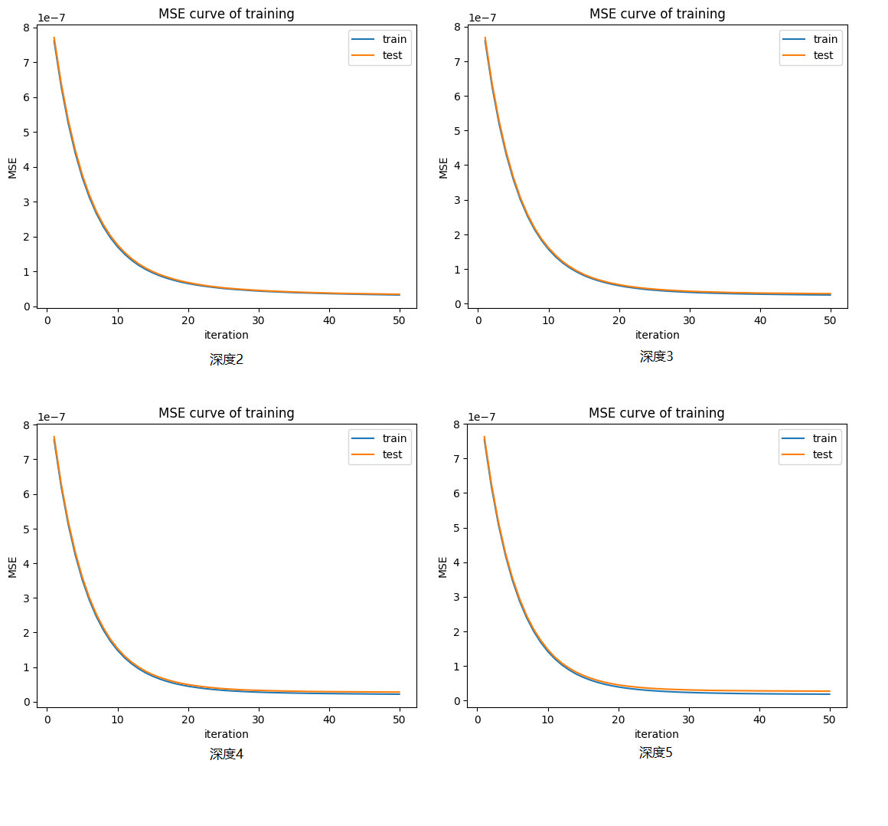

# Report

## 实验目的

使用XGBOOST模型实现回归问题

## 实验原理

### XGBoost

XGBoost 是由多个基模型组成的一个加法模型，假设第 $k$ 个基本模型是 $f_k (x)$, 那么前 $t$ 个模型组成的模型的输出为

$$
y ̂_i^{(t)}=∑^t_{k=1}f_k (x_i )=y ̂_i^{(t-1)}+f_t (x_i )
$$

其中 $x_i$ 为第表示第 $i$ 个训练样本， $y_i$ 表示第 $i$ 个样本的真实标签;  $y ̂_i^{(t)}$ 表示前 $t$ 个模型对第 $i$ 个样本的标签最终预测值。

在学习第 $t$ 个基模型时，XGBoost 要优化的目标函数为:

$$
\begin{split}
Obj^{(t)} &= \sum_{i=1}^n loss(y_i,\hat y_i^{(t)})+\sum_{k=1}^t penalty(f_k)\\
&=\sum_{i=1}^n loss(y_i,\hat y_i^{(t-1)}+f_t(x_i))+\sum_{k=1}^t penalty(f_k)\\
&=\sum_{i=1}^n loss(y_i,\hat y_i^{(t-1)}+f_t(x_i))+ penalty(f_t)+constant\\
\end{split}
$$

其中 $n$ 表示训练样本的数量, $penalty(f_k)$ 表示对第 $k$ 个模型的复杂度的惩罚项,  $loss(y_i,\hat y_i^{(t)})$ 表示损失函数,

例如二分类问题的 

$$
𝑙𝑜𝑠𝑠(𝑦_𝑖,𝑦 ̂_𝑖^{(𝑡)} )=−𝑦_𝑖\cdot \log⁡ p(𝑦 ̂_𝑖^{(t)}=1|𝑥_𝑖)−(1−𝑦_𝑖)\log⁡ (1-p(y ̂_𝑖^{(t)}=1|𝑥_𝑖))
$$

回归问题

$$
𝑙𝑜𝑠𝑠(𝑦_𝑖,𝑦 ̂_𝑖^{(𝑡)} )=(𝑦_𝑖−𝑦 ̂_𝑖^{(𝑡)} )^2
$$

将 $loss(y_i,y ̂_i^{(t-1) }+f_t (x_i))$ 在 $y ̂_i^{(t-1)}$ 处泰勒展开可得

$$
loss(y_i,y ̂_i^{(t-1) }+f_t (x_i))≈loss(y_i,y ̂_i^{(t-1)} )+g_i f_t (x_i )+\frac12 h_i f_t^2 (x_i)
$$

其中 $g_i=\frac{\partial\ loss(y_i,y ̂_i^{(t-1)})}{\partial\  y ̂_i^{(t-1) } }$, $h_i=\frac{\partial^2 loss(y_i,y ̂_i^{(t-1)} )}{\partial \ (y ̂_i^{(t-1)} )^2 }\\ $，即 $g_i$ 为一阶导数，$h_i$ 为二阶导数。

此时的优化目标变为

$$
Obj^{(t)}=∑_{i=1}^n[loss(y_i,y ̂_i^{(t-1)} )+g_i f_t (x_i )+\frac12 h_i f_t^2 (x_i)]+penalty(f_t ) +constant
$$

去掉常数项 $loss(y_i,y ̂_i^{(t-1) })$ (学习第 $t$ 个模型时候， $loss(y_i,y ̂_i^{(t-1) })$ 也是一个固定值) 和 constant，可得目标函数为

$$
Obj^{(t)}=∑_{i=1}^n[g_i f_t (x_i )+\frac12 h_i f_t^2 (x_i)]+penalty(f_t )
$$

### 决策树（回归树）

本实验中，我们以决策树（回归树）为基，因此还需要写出决策树的算法。

假设决策树有 $T$ 个叶子节点，每个叶子节点对应有一个权重。决策树模型就是将输入 $x_i$ 映射到某个叶子节点，决策树模型的输出就是这个叶子节点的权重，即 $f(x_i )=w_q(x_i )$ ，     $w$ 是一个要学的 $T$ 维的向量其中 $q(x_i)$ 表示把输入 $x_i$ 映射到的叶子节点的索引。例如： $q(x_i )=3$，那么模型输出第三个叶子节点的权重，即 $f(x_i )=w_3$。

我们对于某一棵决策树，他的惩罚为

$$
penalty(f)=\gamma\cdot T+\frac12\lambda\cdot\|w\|^2
$$

其中 $\gamma,\lambda$ 为我们可调整的超参数， $T$ 为叶子数， $w$ 为权重向量. 由于显示问题， $\|w\|$ 实际上为 $w$ 的范数，且 $\|w\|^2=\sum_{i=1}^{dim}w_i^2$

我们将分配到第 $j$ 个叶子节点的样本用 $I_j$ 表示，即 $I_j=\{i|q(x_i )=j\} (1≤j≤T)$。

综上，我们在树结构确定（你可以自行确定）时，可以进行如下优化：

$$
\begin{split}
𝑂𝑏𝑗^{(𝑡)}&=∑_{𝑖=1}^𝑛[𝑔_𝑖 𝑓_𝑡 (𝑥_𝑖 )+\frac12 ℎ_𝑖 𝑓_𝑡^2 (𝑥_𝑖)]+𝑝𝑒𝑛𝑎𝑙𝑡𝑦(𝑓_𝑡 )\\
&= ∑_{i=1}^n[g_iw_{q(𝑥_𝑖 )} +\frac12  ℎ_𝑖 𝑤_{𝑞(𝑥_𝑖 )}^2]+𝛾⋅𝑇+\frac12 𝜆⋅\|𝑤\|^2\\
&=∑_{𝑗=1}^𝑇[(∑_{i∈𝐼_𝑗}𝑔_𝑖 )⋅𝑤_𝑗+\frac12⋅(∑_{𝑖∈𝐼_𝑗}ℎ_𝑖+𝜆)⋅𝑤_𝑗^2 ]+𝛾⋅𝑇
\end{split}
$$

简单起见，我们简记 $G_j=∑_{i∈𝐼_𝑗}𝑔_𝑖 , H_j=∑_{i∈𝐼_𝑗}h_𝑖 $

$$
Obj^{(t)}=\sum_{j=1}^T[G_jw_j+\frac12(H_j+\lambda)w_j^2]+\gamma T
$$

**下面推导最优权重与对应的Obj表达式**

$G_jw_j+\frac12(H_j+\lambda)w_j^2$ 是关于 $w_j^2$ 的二次函数，因此在 $w_j=-\frac{G_j}{H_j+\lambda}$ 时为最优权重，可以使得 $G_jw_j+\frac12(H_j+\lambda)w_j^2$ 最小，对应的Obj表达式即为

$$
Obj^{(t)}=-\frac{1}{2}\sum_{j=1}^T\frac{G_j^2}{H_j+\lambda}+\gamma T
$$

## 实验步骤

- 数据拆分（随机抽样）

### 训练模型一 决策树（回归树）

#### 构造过程

对于每一棵决策树，即每一个基的训练，我们可以按照以下步骤划分结点

1. 初始情况下，所有的训练样本 $x_i$ 都分配给根节点。

2. 将根节点添加到待划分列表尾部

3. 从待划分列表头部取一个节点作为当前划分节点，若列表为空算法结束

4. 根据划分前后的收益划分结点，收益为

$$
   \begin{split}
   Gain &= Obj_P-Obj_L-Obj_R\\
   &= -\frac{1}{2}[\frac{G_P^2}{H_P+\lambda}-\frac{G_L^2}{H_L+\lambda}-\frac{G_R^2}{H_R+\lambda}]-\gamma\\
   &= \frac{1}{2}[\frac{G_L^2}{H_L+\lambda}+\frac{G_R^2}{H_R+\lambda}-\frac{(G_L+G_R)^2}{(H_L+H_R)+\lambda}]-\gamma
   \end{split}
$$

   其中 $Obj_P$ 为父结点的得分， $Obj_L,Obj_R$ 为左右孩子的得分.

5. 选择最大增益进行划分，将划分出的两类样本添加到左右孩子中，将左右孩子添加到待划分列表尾部

6. 返回步骤3

选择最大增益的过程如下：

1. 选出所有可以用来划分的特征集合 $\mathcal F$；
2. For feature in $\mathcal F$:
3. ​        ​        将节点分配到的样本的特征 feature 提取出来并升序排列，记作 sorted_f_value_list；
4. ​        ​        For f_value in sorted_f_value_list ：
5. ​        ​        ​        ​        在特征 feature 上按照 f_value 为临界点将样本划分为左右两个集合；
6. ​        ​        ​        ​        计算划分后的增益；
7. 返回最大的增益所对应的 feature 和 f_value。 

#### 停止条件

- 划分后增益小于某个阈值则停止划分；
- 划分后树的深度大于某个阈值停止划分；
- 该节点分配到的样本数目小于某个阈值停止分化。

#### 对特征与样本采样[1]

参考随机森林，对基决策树的每个节点，先从该节点的属性集合中随机选择一个包含k个属性的子集，然后再从这个子集中选择一个最优属性用于划分。属性扰动使得个体学习器相关性进一步减弱，提升了泛化性能

### 训练模型二 XGBoost

#### 构造过程

1.初始化输出矩阵 $y ̂_i^{(0)}=0$

2.将特征矩阵X和上一步的输出矩阵 $y ̂_i^{(t-1)}$ 输入决策树进行训练，得到决策树 $f_t (x)$

3.利用训练结果更新输出矩阵 $y ̂_i^{(t)}=y ̂_i^{(t-1)}+f_t (x_i )$

4.不满足终止条件时返回2，否则算法结束

#### 停止条件

- 学习 $M$ 个颗决策树后停下来；
- 当在验证集上的均方误差小于某个阈值时停下来；
- 当验证集出现过拟合时停下来。

#### 早停机制[2]

早停机制是通过在验证集上验证模型的泛化性能，从而找到模型过拟合的拐点，在拐点处提早停止以防止过拟合的方法，在模型持续迭代k次仍未在训练集上获得改进时，停止算法，k为一可调参数。

#### 学习率[1]

将模型输出改为

$$
y ̂_i^{(t)}=\alpha∑^t_{k=1}f_k (x_i )
$$

这减少了每一颗树对模型的影响，为未来的树留下了空间，降低过拟合，使学习曲线更加平滑

## 实现代码

### 数据拆分

- 随机抽样

  ```python
  array = np.array(df)
  n = array.shape[0]
  np.random.seed(2)
  train_index = set(np.random.choice(n, int(n/4*3), replace=False))
  test_index = set(range(n)) - train_index
  (train, test) = (array[np.array(list(train_index)), :],
                   array[np.array(list(test_index)), :])
  (X_train, y_train) = (train[:, :-1], train[:, -1])
  (X_test, y_test) = (test[:, :-1], test[:, -1])
  ```

### 训练模型一 决策树（回归树）

```python
class Regression_Tree:

    class Node:
        def __init__(self, aggregation, weight, depth):
            self.left = None 
            self.right = None
            self.feature = None # 节点划分特征
            self.value = None # 划分值
            self.aggregation = aggregation # 节点包含样本
            self.weight = weight # 节点权重
            self.depth = depth # 节点在数中深度

    def __init__(self, Lambda=1.0, Gamma=0.0, plot=True):
        self.root = None # 根节点
        self.Lambda = Lambda # 超参数
        self.Gamma = Gamma # 超参数
        self.plot = plot # 是否画图

    def grad(self, y, y_last): # 梯度
    def obj(self, G, H): # 目标函数
    def weight(self, aggregation): # 计算当前节点权重
    def fit(self, X, y, y_last=0, max_depth=None, min_samples_split=None): # 模型训练
    def predict(self, X): # 模型预测
    def MSE(self, X, y): # 均方误差
    def R2(self, X, y): # 相关系数
    def RMSE(self, X, y): # 均方根误差
```

### 训练模型二 XGBOOST

```python
class XGBoost:

    def __init__(self, alpha = 0.1, plot=True):
        self.forest = [] # 基学习器列表
        self.alpha = alpha # 学习率
        self.plot = plot # 是否画图
    def fit(self, X, y, X_test = None, y_test = None, M = 50, max_depth = 5): # 模型训练
    def predict(self, X): # 模型预测
    def MSE(self, X, y): # 均方误差
    def R2(self, X, y): # 相关系数
    def RMSE(self, X, y): # 均方根误差
```

## 实验结果

采用3:1的训练集和测试集

### 训练模型一 决策树（回归树）

超参数 Lambda=0.1, Gamma=0.0 终止条件：最大深度=7 && 叶节点最少样本数=50



训练时间：2.8s

RMSE:1.9352e-04

R2:0.7862

### 训练模型二 XGBOOST

学习50颗决策树后停止，每颗决策树的最大深度为5，学习率0.1



训练时间：1m18.1s

RMSE:1.6317e-04

R2:0.8480

## 方法比较

最佳的模型与sklearn的对比如下，使用的参数见实验结果部分

|                  模型                   | 训练时间 |      RMSE      |     R2     |
| :-------------------------------------: | :------: | :------------: | :--------: |
|       训练模型一 决策树（回归树）       |   2.8s   |   1.9352e-04   |   0.7862   |
|   sklearn DecisionTreeRegressor(参考)   |   0.1s   |   2.4090e-04   |   0.6687   |
|         **训练模型二 XGBOOST**          | 1m18.1s  | **1.6317e-04** | **0.8480** |
| sklearn GradientBoostingRegressor(参考) |   1.2s   |   1.6317e-04   |   0.8480   |

- 实现的决策树除时间外在各参数上均优于sklearn DecisionTreeRegressor
- 实现的XGBOOST除时间外在各参数上均与sklearn GradientBoostingRegressor相当

### 训练模型一 决策树（回归树）的不同停止策略比较

超参数 Lambda=1.0, Gamma=0.0

|                 模型                  | 训练时间 |      RMSE      |     R2     |
| :-----------------------------------: | :------: | :------------: | :--------: |
|            不设置终止条件             |   5.5s   |   2.0258e-04   |   0.7657   |
|              最大深度=6               |   2.3s   |   2.0132e-04   |   0.7686   |
|            **最大深度=7**             |   3.2s   | **1.9844e-04** | **0.7752** |
|              最大深度=8               |   4.5s   |   1.9998e-04   |   0.7717   |
|         叶节点最少样本数=500          |   1.6s   |   2.3110e-04   |   0.6951   |
|         叶节点最少样本数=100          |   3.1s   |   2.0528e-04   |   0.7594   |
|        **叶节点最少样本数=50**        |   4.3s   | **2.0054e-04** | **0.7704** |
| **最大深度=7 && 叶节点最少样本数=50** |   3.1s   | **1.9681e-04** | **0.7788** |

- 随着最大深度增加，模型性能先升高后下降，出现过拟合
- 随着叶节点最少样本数降低，模型性能先升高后下降，出现过拟合
- 结合最大深度和叶节点最少样本数取得了最优结果

### 训练模型一 决策树（回归树）的不同超参数比较

超参数$\gamma$与节点数目相关，在节点划分时加上了一个额外的罚值，会让模型在划分增益不大时停止划分，但在实现时已经设置了停止划分的策略，故将超参数$\gamma$设置为0，重点关注超参数$\lambda$的影响

终止条件：最大深度=7 && 叶节点最少样本数=50

|          模型          | 训练时间 |      RMSE      |     R2     |
| :--------------------: | :------: | :------------: | :--------: |
|     $\lambda=0.01$     |   2.9s   |   1.9909e-04   |   0.7737   |
| $\mathbf{\lambda=0.1}$ |   2.8s   | **1.9352e-04** | **0.7862** |
|     $\lambda=0.5$      |   3.1s   |   1.9800e-04   |   0.7762   |
|     $\lambda=1.0$      |   3.1s   |   1.9681e-04   |   0.7788   |
|     $\lambda=5.0$      |   2.3s   |   2.2449e-04   |   0.7123   |

### 训练模型二 XGBOOST 的不同参数比较

因为XGBOOST是集成较弱的基学习器，并且基学习器需要串行生成，因此基学习器的深度设定不宜过高，以提升效率

停止策略设定为生成50颗决策树后停止

|    模型    | 训练时间 |    RMSE    |   R2   |
| :--------: | :------: | :--------: | :----: |
| 最大深度=2 |  33.9s   | 1.8553e-04 | 0.8035 |
| 最大深度=3 |  45.3s   | 1.8944e-04 | 0.7951 |
| 最大深度=4 |  58.9s   | 1.8975e-04 | 0.7944 |



在训练集合测试集上的曲线如图所示，可以看到在基学习器的学习能力提升时，出现了明显的过拟合

为解决过拟合问题，引入学习率 $\alpha$ ，这减少了每一颗树对模型的影响，为未来的树留下了空间，降低过拟合，使学习曲线更加平滑

以下设定学习率为0.1

|      模型      |  训练时间   |      RMSE      |     R2     |
| :------------: | :---------: | :------------: | :--------: |
|   最大深度=2   |    32.6s    |   1.8463e-04   |   0.8054   |
|   最大深度=3   |    49.5s    |   1.7035e-04   |   0.8343   |
|   最大深度=4   |    58.9s    |   1.6658e-04   |   0.8416   |
| **最大深度=5** | **1m18.1s** | **1.6317e-04** | **0.8480** |

从上图可以看到，随着基学习器的学习能力提升，仍有轻微过拟合的倾向，但两曲线已基本重合

## 结果分析

本次实验实现了决策树（回归树）以及基于决策树的XGBOOST算法，结果与sklearn相当

因为模型是非线性的，因此在训练中很容易发生过拟合

在决策树（回归树）中防止过拟合的方法是调整**终止条件**，在样本上测试得到的最佳条件为超参数 Lambda=0.1, Gamma=0.0 终止条件：最大深度=7 && 叶节点最少样本数=50

在XGBOOST算法中中防止过拟合的方法是**早停**或者设置**学习率**，在样本上测试得到的最佳条件为学习50颗决策树后停止，每颗决策树的最大深度为5，学习率0.1

## 参考文献

[1]Chen, T., & Guestrin, C. : XGBoost: A Scalable Tree Boosting System  arXiv:1603.02754

[2[Jason Brownlee : Avoid Overfitting By Early Stopping With XGBoost In Python (https://machinelearningmastery.com/avoid-overfitting-by-early-stopping-with-xgboost-in-python/)
