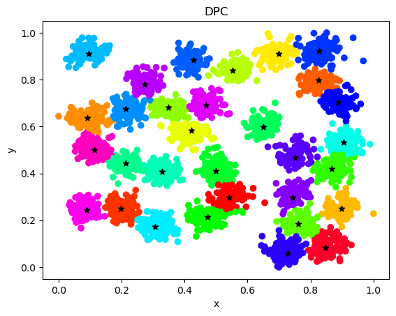

# Report

## 实验目的

使用DPC算法进行聚类

## 实验原理

### 算法思想

k-means将中心视作所有点的均值，因此偏好于球形的簇，对于非球形簇效果不好

DBSCAN需要设定一个密度阈值以区分噪声

DPC算法集成了 k-means 和 DBSCAN 两种算法的思想

- 聚类中心周围密度较低，中心密度较高
- 聚类中心与其它密度更高的点之间通常都距离较远
- 与其它密度高的点距离远，自身密度低的点是离群点

DPC算法将点的局部密度用 $\rho_i = \sum_{j}\chi(d_{ij}-d_c)$ 表示，它只对 $\rho_i$ 的相对大小敏感，因此对于大数据集， $d_c$ 的选择具有鲁棒性。

用 $\delta_i=\mathop {min}\limits_{j:\rho_j>\rho_i} d_{ij}$ 衡量与其它密度最高的点的最小距离，对于类中心点，有着较大的 $\rho_i$ 和 $\delta_i$ ，从 $\rho-\delta$ 图中可以识别出类中心点，对于离群点，有着较小的 $\rho_i$ 和较大的 $\delta_i$

### 算法流程

1. 选择一个合适的距离阈值 $d_c$
2. 对于每一个数据点i，计算
   - 局部密度: $\rho_i = \sum_{j}\chi(d_{ij}-d_c)$,where $\chi(x)=1$ if $x<0$ and $\chi(x)=0$ otherwise
   - 与更高密度的点的距离: $\delta_i=\mathop {min}\limits_{j:\rho_j>\rho_i} d_{ij}$，特别地，对于密度最大的点 $\delta_i=\mathop {max}\limits_{j} d_{ij}$
3. 绘制决策图，人工判断类中心点与离群点，选择合适的阈值 $\rho_t$ and $\delta_t$
4. 对于数据点i $\rho_i>=\rho_t$ and $\delta_i>=\delta_t$的点被视作类中心点， $\rho_i<\rho_t$ and $\delta_i>=\delta_t$ 的点被视作离群点
5. 按密度由高到低的顺序，将各个点分配给其有着更高密度的最近邻居所属的类

## 实现代码

### 数据预处理

```python
# 归一化
array = [np.array(dfi.apply(lambda x: (x-np.min(x))/(np.max(x)-np.min(x)))) for dfi in df]
for i in range(len(df)):
    print(array[i])
```

### 训练模型 DPC

为了加快算法的执行速度，尽量避免使用for循环，使用broadcast来进行距离矩阵的计算

```python
class DPC:
    def __init__(self, d_c):
        self.d_c = d_c

    def fit(self, X):
        self.dis = np.linalg.norm(np.expand_dims(X, 1)-np.array([X]), axis=2)
        self.rho = np.sum(self.dis < self.d_c, axis=1)
        self.rho_sorted_index = np.array(
            sorted(range(X.shape[0]), key=lambda x: self.rho[x], reverse=True))
        self.delta = np.frompyfunc(lambda x: np.min(self.dis[self.rho_sorted_index[x]][self.rho_sorted_index[0:x]]) if not x == 0 else np.max(
            self.dis[self.rho_sorted_index[0]]), 1, 1)(np.frompyfunc(lambda x: np.argwhere(self.rho_sorted_index == x)[0][0], 1, 1)(np.array(range(X.shape[0]))))
        
        plt.figure('Decision Graph')
        plt.title('Decision Graph')
        plt.xlabel('rho')
        plt.ylabel('delta')
        plt.scatter(self.rho, self.delta,s=10)
        plt.show()

    def predict(self, X, rho_value, delta_value):
        centers = np.argwhere((self.rho >= rho_value) & (
            self.delta >= delta_value)).flatten()
        ood = np.argwhere((self.rho < rho_value) & (
            self.delta > delta_value)).flatten()
        self.label = np.zeros(X.shape[0])
        j = 1
        print('centers:{}'.format(centers))
        for i in range(len(centers)):
            self.label[centers[i]] = j
            j += 1
        for i in range(X.shape[0]):
            if (not self.rho_sorted_index[i] in ood) and self.label[self.rho_sorted_index[i]] == 0:
                self.label[self.rho_sorted_index[i]] = self.label[self.rho_sorted_index[np.argmin(
                    self.dis[self.rho_sorted_index[i]][self.rho_sorted_index[:i]])]]
        
        plt.figure('DPC')
        plt.title('DPC')
        plt.xlabel('x')
        plt.ylabel('y')
        plt.scatter(X[:, 0], X[:, 1], c=self.label, cmap="gist_rainbow")
        plt.scatter(X[centers][:, 0], X[centers][:, 1], c='black', marker='*')
        plt.show()

```

## 实验结果

### Aggregation数据集

$d_c=0.10,\rho_t=30,d_t=0.1$

$DBI:0.5461$


### D31数据集

$d_c=0.05,\rho_t=60,d_t=0.1$

$DBI:0.5524$




### R15数据集

$d_c=0.05,\rho_t=30,d_t=0.1$

$DBI:0.3147$


## 方法比较

最佳的模型与sklearn的对比如下，使用的参数见实验结果部分

#### Aggregation数据集

|         模型         | 训练时间 |    DBI     |
| :------------------: | :------: | :--------: |
|         DPC          |   0.5s   | **0.5461** |
| sklearn KMeans(参考) |   0.4s   |   0.7056   |
| sklearn DBSCAN(参考) |   0.2s   |   0.6828   |


#### D31数据集

|         模型         | 训练时间 |    DBI     |
| :------------------: | :------: | :--------: |
|         DPC          |   1.1s   | **0.5524** |
| sklearn KMeans(参考) |   0.6s   |   0.5471   |
| sklearn DBSCAN(参考) |   0.3s   |   0.6332   |


#### R15数据集

|         模型         | 训练时间 |    DBI     |
| :------------------: | :------: | :--------: |
|         DPC          |   0.4s   | **0.3147** |
| sklearn KMeans(参考) |   0.6s   |   0.3147   |
| sklearn DBSCAN(参考) |   0.3s   |   0.3488   |


## 结果分析

- DPC算法与KMeans和DBSCAN的执行速度相似

- DPC算法在处理非球形簇的时候具有良好的效果，这在Aggregation数据集中可以看到，而KMeans算法无法正确分类
- DPC算法在处理有高度重叠性的簇时有良好的效果，这在D31数据集中可以看到，而DBSCAN算法无法正确分类
- DPC算法在处理同时有距离较近的和距离较远的簇时可以正确分类，这在R15数据集中可以看到，而DBSCAN算法无法正确分类
- DPC算法集成了 k-means 和 DBSCAN 两种算法的思想，可以处理非球形的簇以及有高度重叠性的簇。同时，基于决策图的参数选择可以便于区分簇以及噪声所带来的离群点。

