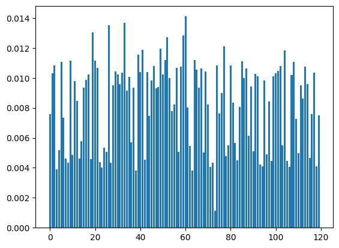
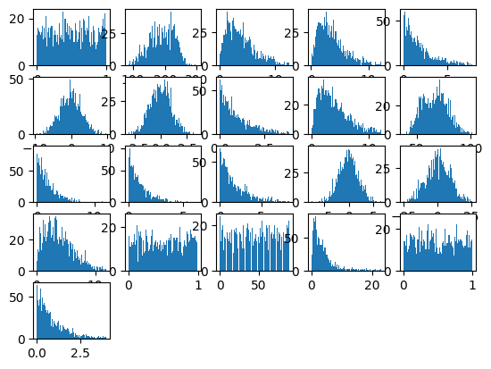

# Report

## 实验目的

​	根据所学知识，对所给数据集进行数据预处理、数据划分、模型训练、模型验证、实验分析

## 实验原理

### 数据预处理

数据中包含的Null数据：

- 用中位数、均值、随机采样的方法对Null数据进行填充
- 适当丢弃Null数据

数据中包含的outlier数据：

1. 计算数据的均值与方差
2. 将均值3倍方差范围外的数据替换为Null
3. 填充Null数据
4. 重复1-3直至均值与方差收敛

数据降维：为了缓解特征较多时产生的维度灾难，可以采用多维缩放（MDS）、主成分分析、核化主成分分析、等度量映射、局部线性嵌入、近邻成分分析等方法对数据特征进行降维

数据降噪：主成分分析PCA可以用作噪音的过滤，因为任何一个成分的变化影响都远远大于随机噪声的影响的，所以可以用主成分来重构原始数据。

特征提取：使用过滤式、包裹式、嵌入式方法进行特征选择

数据归一化：使特征具有相同的度量尺度

### 数据划分

使用留出法、交叉验证法、自助法等方法进行数据划分，以便充分测试模型的性能

### 模型训练

使用线性回归模型、决策树模型、神经网络模型、支持向量机以及XGBoost等分类模型来完成标签预测任务

### 模型验证

将训练集上训练好的模型应用在测试集得到最终的输出结果

### 假设检验

使用二项检验、t检验、交叉验证t检验、McNemar检验、Friedman检验、Nemenyi后续检验等方法验证模型的泛化性能

## 实验步骤

### 数据预处理

将数据从文件中读入

```python
dfx = pd.read_csv('train_feature.csv')
dfy = pd.read_csv('train_label.csv')
```

对缺失值进行随机采样填充，使用均值或中位数填充会改变数据的分布，因此采用均值填充

```python
for i in range(dfx.shape[1]):
    empty = dfx.iloc[:, i].isnull()
    dfx.iloc[empty.values, i] = np.random.choice(
        dfx.iloc[~empty.values, i].values, len(dfx.iloc[empty.values, i]))
```

处理异常值，将将均值3倍方差范围外的数据替换为Null，再进行随机填充

```python
dfx.iloc[:, i] = dfx.iloc[:, i].apply(lambda x: None if x < mean - 3 * std or x > mean + 3 * std else x)
```

归一化处理

```python
dfx = dfx.apply(lambda x: (x-np.min(x))/(np.max(x)-np.min(x)))
dfx = dfx.apply(lambda x: (x-np.mean(x))/np.std(x))
```

数据拆分，对四类数据进行分层抽样

```python
def spilit_data()
```

### 模型评估与选择

#### 线性回归模型

基于之前实验所实现的Logistic回归模型结合OvR方法进行训练

```python
from model import *

X_train, y_train, X_test, y_test = spilit_data()
y_train1 = np.frompyfunc(lambda x: 1 if x == 0 else 0, 1, 1)(y_train)
y_train1 = np.array(y_train1, dtype=np.float64)
y_train2 = np.frompyfunc(lambda x: 1 if x == 1 else 0, 1, 1)(y_train)
y_train2 = np.array(y_train2, dtype=np.float64)
y_train3 = np.frompyfunc(lambda x: 1 if x == 2 else 0, 1, 1)(y_train)
y_train3 = np.array(y_train3, dtype=np.float64)
y_train4 = np.frompyfunc(lambda x: 1 if x == 3 else 0, 1, 1)(y_train)
y_train4 = np.array(y_train4, dtype=np.float64)
model1 = LogisticRegression(gamma=0, plot=False)
model1.fit(X_train, y_train1,pattern='newton')
model2 = LogisticRegression(gamma=0, plot=False)
model2.fit(X_train, y_train2,pattern='newton')
model3 = LogisticRegression(gamma=0, plot=False)
model3.fit(X_train, y_train3,pattern='newton')
model4 = LogisticRegression(gamma=0, plot=False)
model4.fit(X_train, y_train4,pattern='newton')

result = predictOvR(X_train, model1, model2, model3, model4)
```

使用sklearn的LogisticRegression库进行训练

```python
from sklearn.linear_model import LogisticRegression

X_train, y_train, X_test, y_test = spilit_data()
model = LogisticRegression()
model.fit(X_train, y_train.flatten())
```

Logistic线性回归模型本质上是广义线性模型，对于非线性的数据集的训练结果不太理想，在本数据集上在训练集上的准确率不高，因此不采用此模型

#### 神经网络模型

使用sklearn的MLPClassifier库进行训练

```python
from sklearn.neural_network import MLPClassifier

X_train, y_train, X_test, y_test = spilit_data()
model = MLPClassifier()
model.fit(X_train, y_train.flatten())
```

神经网络模型在小数据集上容易过拟合，本数据集数据量较小，过拟合较为严重，因此不采用此模型

#### 支持向量机

基于之前实验所实现的svm模型结合OvR方法进行训练

```python
from model import *

X_train, y_train, X_test, y_test = spilit_data()
y_train1 = np.frompyfunc(lambda x: 1 if x == 0 else -1, 1, 1)(y_train)
y_train1 = np.array(y_train1, dtype=np.float64)
y_train2 = np.frompyfunc(lambda x: 1 if x == 1 else -1, 1, 1)(y_train)
y_train2 = np.array(y_train2, dtype=np.float64)
y_train3 = np.frompyfunc(lambda x: 1 if x == 2 else -1, 1, 1)(y_train)
y_train3 = np.array(y_train3, dtype=np.float64)
y_train4 = np.frompyfunc(lambda x: 1 if x == 3 else -1, 1, 1)(y_train)
y_train4 = np.array(y_train4, dtype=np.float64)

model1 = SVM(X_train.shape[1], plot = False)
model1.fit(X_train, y_train1)
model2 = SVM(X_train.shape[1], plot = False)
model2.fit(X_train, y_train2)
model3 = SVM(X_train.shape[1], plot = False)
model3.fit(X_train, y_train3)
model4 = SVM(X_train.shape[1], plot = False)
model4.fit(X_train, y_train4)

result = predictOvR(X_train, model1, model2, model3, model4)
```

使用sklearn的svm库进行训练

```python
from sklearn import svm

X_train, y_train, X_test, y_test = spilit_data()
model = svm.SVC()
model.fit(X_train, y_train.flatten())
```

支持向量机模型在样本较多时训练较慢，且决策过程不直观，不便于特征选择，且性能与决策树模型相比没有显著优势，因此不采用此模型

#### 决策树模型

使用sklearn的DecisionTreeClassifier库进行训练，进行十次四折交叉验证

```python
from sklearn.tree import DecisionTreeClassifier
from sklearn.model_selection import cross_val_score
score = 0
for j in range (10):
    model = DecisionTreeClassifier(max_depth= 10)
    scores = cross_val_score(model, X_data[:, :-1], X_data[:, -1].flatten(), cv=4, scoring='accuracy', n_jobs=-1)
    score += scores.mean()
print(score / 10)
```

决策树模型考虑了变量之间的相互作用、可以处理非线性特征、有直观的决策规则，因此采用此模型进行包裹式特征选择

#### XGBoost模型

使用xgboost的XGBClassifier库进行训练，进行十次四折交叉验证

```python
from xgboost import XGBClassifier
from sklearn.model_selection import cross_val_score
score = 0
for j in range (10):
    model = XGBClassifier(max_depth=4,learning_rate =0.02, n_estimators = 21)
    scores = cross_val_score(model, X_data[:, :-1], X_data[:, -1].flatten(), cv=4, scoring='accuracy', n_jobs=-1)
    score += scores.mean()
print(score / 10)
```

XGBClassifier模型基于决策树做集成学习，使用弱决策树避免过拟合，因此作为最终的训练模型

#### 结论

- 使用决策树模型进行包裹式特征选择
- 使用XGBoost模型进行模型训练

### 特征提取

为增强特征提取的准确性，在数据预处理时，对所有outlier数据和Null数据进行删除，得到一个较小的数据集

基于决策树模型进行包裹式特征选择

```python
from sklearn.tree import DecisionTreeClassifier
from matplotlib import pyplot as plt

result = np.zeros((120, ))
j = 0
for i in range (1, 10000):
    X_train, y_train, X_test, y_test = spilit_data()
    model = DecisionTreeClassifier(max_features='log2', max_depth= 10)
    model.fit(X_train, y_train.flatten())
    if model.score(X_test, y_test) >= 0.27:
        j += 1
        result += np.array(model.feature_importances_)
print(j)

plt.bar(range(0, 120), result / j)
plt.show()
```

将测试集准确率较高的模型的各特征的权重分布平均后作图如下



找出其中权重较高的特征

```python
for i in range(120):
    if result[i] / j > 0.011:
        print(i)
```

在数据预处理时，提取这些特征

```python
dfx = pd.DataFrame(dfx, columns=[feature])
```

对这些特征绘制直方图如下，可以看出在数据预处理后，其中的outlier数据已被随机采样剔除



在特征提取后，在较小的数据集上的准确率由25-26%上升至26%-27%

### 调参

sklearn提供了网格搜索和随机搜索的自动调参方法，网格搜索法会尝试所有的参数组合，找到最优的参数，随机搜索是在空间中采样出参数组合，找到最优的参数

对于决策树模型，它的训练时间较短，使用网格搜索法自动调参，主要的调整参数为'criterion'、'splitter'、'max_depth'、'max_features'，其中max_depth过高时会造成过拟合，因此范围定为1-30

```python
from sklearn.model_selection import GridSearchCV
from sklearn.tree import DecisionTreeClassifier

# 使用网格搜索进行调参
clf = DecisionTreeClassifier(random_state=0)
params = {
    'criterion': ['gini', 'entropy'],
    'splitter': ['best', 'random'],
    'max_depth': range(1, 30, 1),
    'max_features' : ['auto', 'sqrt', 'log2', None]
}
gs = GridSearchCV(clf, params, cv=4, scoring='accuracy', n_jobs=-1)
gs.fit(X_data[:, :-1], X_data[:, -1])

print(gs.best_params_)
print(gs.best_score_)
```

对于XGBoost模型，它的训练时间较长，使用随机搜索法自动调参，主要的调整参数为'n_estimators'、'max_depth'、'learning_rate'，其中n_estimators、max_depth过高时会造成过拟合，因此取值较小，learning_rate过大时会使之后的学习器的学习空间过小，因此取值较小

```python
from sklearn.model_selection import RandomizedSearchCV
import xgboost as xgb

# 使用随机搜索进行调参
clf = xgb.XGBClassifier(random_state=0)
param_dist = {
    'n_estimators': range(1, 50, 1),
    'max_depth': range(2, 15, 1),
    'learning_rate': np.linspace(0.01, 0.1, 10),
}
rs = RandomizedSearchCV(clf, param_dist, cv=4, scoring='accuracy', n_iter=500, n_jobs=-1)
rs.fit(X_data[:, :-1], X_data[:, -1])

print(rs.best_params_)
print(rs.best_score_)
```

### 模型验证

将训练集上训练好的模型应用在测试集得到最终的输出结果

```python
from xgboost import XGBClassifier

model = XGBClassifier(max_depth=4,learning_rate =0.02, n_estimators = 21)
model.fit(X_data[:, :-1], X_data[:, -1].flatten())
result = model.predict(np.array(dfx))
df = pd.DataFrame(result, columns=['label'])
df.to_csv('test_label.csv', index=False)
```

### 假设检验

根据四折交叉验证进行交叉验证t检验

特征提取前未调参的四折交叉验证结果为：0.232 0.2532 0.2392 0.2436

特征提取后并调参的四折交叉验证结果为：0.2628 0.2748 0.2436 0.2556

对每个结果求差得到：0.0308 0.0216 0.0044 0.012

差值的均值与标准差为：0.0172 0.01148

$\tau_t=|\frac{\sqrt{k}\mu}{\sigma}|=3.00>t_{0.05,3}=2.353$

在显著性水平$\alpha=0.10$的条件下，认为特征提取后并调参的学习器性能更优

## 实验结果

实验中提取的有效特征：['feature_2','feature_5','feature_19','feature_26','feature_33',

'feature_39','feature_41','feature_46','feature_49','feature_50','feature_51','feature_52',

'feature_58','feature_59','feature_60','feature_65','feature_85','feature_87','feature_99',

'feature_102','feature_104']

十次四折交叉验证的准确率

|             数据集              |  模型   | 特征提取前未调参 | 特征提取后并调参 |
| :-----------------------------: | :-----: | :--------------: | :--------------: |
|  删除所有outlier数据和Null数据  | 决策树  |       0.25       |      0.265       |
| 对outlier数据和Null数据采样填充 | XGBOOST |       0.25       |       0.26       |

## 实验分析

​	在此次实验中，根据所学知识，对所给数据集进行数据预处理、数据划分、模型训练、模型验证、实验分析，从含有大量冗余特征的原始数据集中提取了有效特征，在决策树与基于决策树的XGBOOST模型上进行自动调参获得了准确率的提升，并通过了假设检验。

